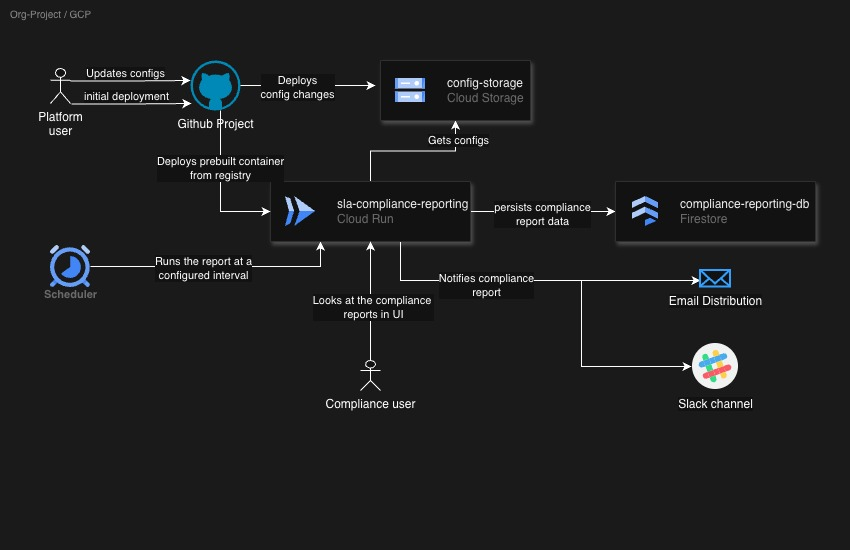

# SLA Compliance Monitoring
## Architecture
- Company that developed this tool publishes it to docker container registry
- Platform team from customer company gets the docker container from registry and does the initial deployment to either
cloud run or GKE.
- Platform team updates the sla compliance settings as per their organization services
- gitlab picks up the changes and updates them to cloud storage location
- Platform team creates the necessary firestore db infrastructure for storing the compliance reporting application that 
is running on cloud run
- once the compliance reporting service and db are setup then platform team sets up cloud scheduler to schedule the
compliance reports
- Now cloud scheduler invokes the cloud run api service to run the report
- API service after generating the report it stores in the DB and also notifies to notification channels
- Now Compliance user can view the reports on the UI or they can receive via emails

